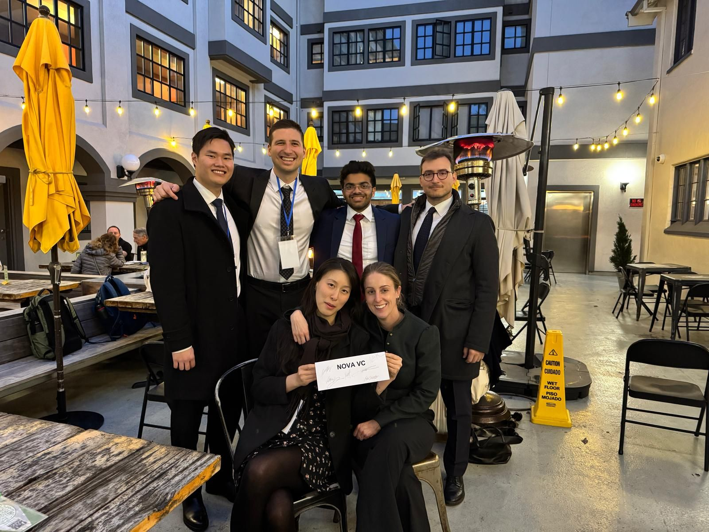

---
# Display name
title: Karthik Rajgopal

# Name pronunciation (optional)
name_pronunciation: ''

# Full name (for SEO)
first_name: Karthik
last_name: Rajgopal

# # Status emoji
# status:
#   # icon: ☕️

# Is this the primary user of the site?
superuser: true

# Highlight the author in author lists? (true/false)
highlight_name: true

# Role/position/tagline
role: MEng '25 Graduate

# Organizations/Affiliations to display in Biography blox
organizations:
  - name: UC Berkeley
    # url: https://openai.com/

# Social network links
# Need to use another icon? Simply download the SVG icon to your `assets/media/icons/` folder.
profiles:
  - icon: at-symbol
    url: 'mailto:karthik_rajgopal@berkeley.edu'
    label: E-mail 
  # - icon: brands/x
  #   url: https://twitter.com/GetResearchDev
  # - icon: brands/instagram
  #   url: https://www.instagram.com/
  - icon: brands/github
    url: https://github.com/Karthik-Rajgopal
  - icon: brands/linkedin
    url: https://www.linkedin.com/in/karthik-rajgopal-1035021ba/
  - icon: academicons/google-scholar
    url: https://scholar.google.com/citations?user=S3RvSUYAAAAJ&hl=en&authuser=1
  # - icon: academicons/orcid
  #   url: https://orcid.org/

interests:
  - Robotics
  - Control Systems
  - Mechanical Design

education:
  - area: MEng Mechanical Engineering (Control of Robotics & Autonomous Systems track)
    institution: University of California, Berkeley
    date_start: 2024-08-01
    date_end: 2025-05-21
    summary: |

     GPA: 3.6/4.0

      Courses included:
      - Experiential Advanced Control Design I (Model Predictive Control)
      - Experiential Advanced Control Design II (State Estimation - Bayesian Tracking, Kalman Filter [EKF, UKF], Particle Filter)
      - Advanced Product Development 
      - Modeling & Control of Multi-Agent Systems
      - Deep Tech Commercialization Strategies
      - Lean LaunchPad
    #   Thesis on _Why LLMs are awesome_. Supervised by [Prof Joe Smith](https://example.com). Presented papers at 5 IEEE conferences with the contributions being published in 2 Springer journals.
    # button:
    #   text: ''
    #   url: ''

  - area: BEng Mechanical Engineering
    institution: Birla Institute of Technology & Science (BITS) Pilani, Pilani Campus
    date_start: 2019-08-01
    date_end: 2023-05-31
    summary: |
      GPA: 3.8/4.0

work:
  - position: Project Associate
    company_name: Robert Bosch Centre for Cyber-Physical Systems, Indian Institute of Science
    company_url: 'https://www.stochlab.com/'
    company_logo: ''
    date_start: 2022-08-01
    date_end: '2024-06-15'
    summary: |2-
      Responsibilities included:
      - Developed a 3D printed bipedal robot called StochBiRo actuated through a dual-stage HTD timing belt transmission (3:1 at each stage).
      - Designed a 3-DOF robotic leg driven using compound planetary actuators for a 25 kg payload capacity quadruped.
      - Implemented and verified a real-time safety filter named Collision Cone Control Barrier Functions on unicycle and bicycle kinematic models. 
  - position: Developer Intern
    company_name: Madras MindWorks Pvt. Ltd. 
    company_url: 'https://madrasmindworks.com/'
    company_logo: ''
    date_start: 2021-05-15
    date_end: 2021-07-31
    summary: |
      Responsibilities included:
      - Developed cricket graphical analytics for a VR cricket game, CricketR on the Canvas platform in Unity engine.
      - Implemented classes for each analytics in C#, utilizing JSON for efficient data transmission from user gameplay.
      - Designed and integrated an intuitive UI, enhancing the user experience for efficient performance evaluation.

# Skills
# Add your own SVG icons to `assets/media/icons/`
skills:
  - name: Technical Skills
    items:
      - name: Python
        description: ''
        percent: 80
        icon: code-bracket
      - name: SolidWorks
        description: ''
        percent: 100
        icon: chart-bar
      - name: SQL
        description: ''
        percent: 40
        icon: circle-stack
  - name: Hobbies
    color: '#eeac02'
    color_border: '#f0bf23'
    items:
      - name: Hiking
        description: ''
        percent: 60
        icon: person-simple-walk
      - name: Cats
        description: ''
        percent: 100
        icon: cat
      - name: Photography
        description: ''
        percent: 80
        icon: camera

languages:
  - name: English
    percent: 100
  - name: Malayalam
    percent: 100
  - name: Hindi
    percent: 50
  # - name: Spanish
  #   percent: 10

# Awards.
#   Add/remove as many awards below as you like.
#   Only `title`, `awarder`, and `date` are required.
#   Begin multi-line `summary` with YAML's `|` or `|2-` multi-line prefix and indent 2 spaces below.
awards:
  - title: Venture Capital Investment Competition (VCIC)
    url: http://vcicberkeley.org/
    date: '2025-02-14'
    awarder: Berkeley Haas
    # icon: "custom/vcic"
    summary: |2-
      My team came Second Place in Berkeley level of this competition. We conducted founder due diligence, valuation, and competitive analysis to assess venture investment opportunities. As part of this competition, we participated in partner meetings, drafted term sheets with key terms, and performed market research on startups.

      
  # - title: Blockchain Fundamentals
  #   url: https://www.edx.org/professional-certificate/uc-berkeleyx-blockchain-fundamentals
  #   date: '2023-07-01'
  #   awarder: edX
  #   icon: edx
  #   summary: |
  #     Learned:
  #     - Synthesize your own blockchain solutions
  #     - Gain an in-depth understanding of the specific mechanics of Bitcoin
  #     - Understand Bitcoin’s real-life applications and learn how to attack and destroy Bitcoin, Ethereum, smart contracts and Dapps, and alternatives to Bitcoin’s Proof-of-Work consensus algorithm
  # - title: 'Object-Oriented Programming in R'
  #   url: https://www.datacamp.com/courses/object-oriented-programming-with-s3-and-r6-in-r
  #   certificate_url: https://www.datacamp.com
  #   date: '2023-01-21'
  #   awarder: datacamp
  #   icon: datacamp
  #   summary: |
  #     Object-oriented programming (OOP) lets you specify relationships between functions and the objects that they can act on, helping you manage complexity in your code. This is an intermediate level course, providing an introduction to OOP, using the S3 and R6 systems. S3 is a great day-to-day R programming tool that simplifies some of the functions that you write. R6 is especially useful for industry-specific analyses, working with web APIs, and building GUIs.
---

## About Me

I’m a robotics engineer with an MEng from UC Berkeley, where I worked on RL-based drone racing, multi-robot coordination, and MPC for autonomous systems. Previously, at Indian Institute of Science, I designed a quadruped and developed safety-critical controllers.

My focus spans control, learning, and mechanical design, with exposure to tech commercialization through Berkeley Haas courses like Lean LaunchPad & Deep Tech Commercialization Strategies.

Let’s connect if you’re into robotics, intelligent control, or deep-tech ventures.